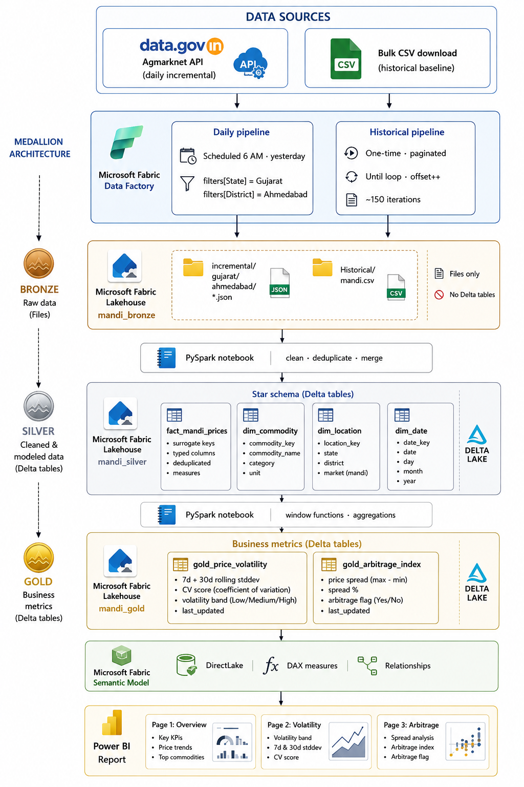

# India Mandi Price Intelligence Platform

> An end-to-end data engineering project built on **Microsoft Fabric** and **Power BI** that transforms 15+ years of raw government agricultural market data into actionable price intelligence for farmers, policymakers, and traders. [Presentation]([https://data.gov.in](https://amanrajputde.github.io/Mandi-POC-website/))

---

## What this project solves

India has 7,000+ regulated wholesale markets (mandis) trading 300+ commodities daily. The government collects and publishes this price data — but in a raw, unusable form. Meanwhile:

- A farmer in Ahmedabad has no way to know if a mandi 50 km away is offering 30% more for their produce today
- Traders exploit this information gap, pocketing the price difference as margin
- Policymakers cannot identify markets in distress without manually crunching government CSVs

This platform ingests daily mandi price data from [data.gov.in](https://data.gov.in), processes it through a medallion architecture on Microsoft Fabric, and surfaces three engineered metrics in a Power BI report:

| Metric | What it answers |
|---|---|
| **Price volatility score** | Is this market stable or chaotic? (7-day and 30-day rolling coefficient of variation) |
| **Arbitrage index** | Where is the largest price spread for the same commodity? |
| **MSP gap** *(future)* | Are farmers being paid below the government's minimum support price? |

---

## Architecture



---

## Tech stack

| Layer | Technology |
|---|---|
| Ingestion | Microsoft Fabric Data Factory (Web activity, Until loop, Scheduled trigger) |
| Storage | Microsoft Fabric Lakehouse (OneLake, Delta format) |
| Transformation | PySpark Notebooks (Apache Spark on Fabric) |
| Semantic layer | Fabric Semantic Model (DirectLake mode) |
| Visualisation | Power BI (DAX measures, conditional formatting, slicers) |
| Data source | [data.gov.in Agmarknet API](https://data.gov.in/resource/current-daily-price-various-commodities-various-markets-mandi) |

---

## Data source

**API:** `https://api.data.gov.in/resource/9ef84268-d588-465a-a308-a864a43d0070`

| Parameter | Value |
|---|---|
| `format` | `json` |
| `limit` | `100` (max per call) |
| `offset` | `0, 100, 200, ...` (pagination) |
| `filters[State]` | `Gujarat` |
| `filters[District]` | `Ahmedabad` |
| `filters[Arrival_Date]` | `dd/MM/yyyy` (daily incremental) |

### Schema

| Column | Type | Description |
|---|---|---|
| `Arrival_Date` | string (dd/MM/yyyy) | Date produce arrived at the mandi |
| `State` | string | Indian state |
| `District` | string | Administrative district |
| `Market` | string | Specific mandi name |
| `Commodity` | string | Crop or produce |
| `Commodity_Code` | integer | Stable numeric ID (use for joins, not name) |
| `Variety` | string | Sub-type (e.g. Jyoti potato, Red onion) |
| `Grade` | string | Quality grade — FAQ = Fair Average Quality |
| `Min_Price` | integer | Lowest price traded, ₹ per quintal (100 kg) |
| `Max_Price` | integer | Highest price traded, ₹ per quintal |
| `Modal_Price` | integer | Most frequently traded price — **primary metric** |

> All prices are in **₹ per quintal (100 kg)**. Divide by 100 to get ₹/kg.

---

## Medallion architecture

### Bronze — raw landing zone

Raw files exactly as received. Never modified. Partitioned by date. Replayable if anything downstream breaks.

```
Files/
  bronze/
    incremental/gujarat/ahmedabad/   ← daily JSON batches from API
    historical/mandi.csv             ← one-time bulk CSV download
```

### Silver — clean star schema

A PySpark notebook reads both Bronze sources, reconciles schema differences, deduplicates on composite key `(state, district, market, commodity, variety, arrival_date)`, and writes four Delta tables.

**Star schema:**

```
                    fact_mandi_prices
                   ┌────────────────┐
                   │ location_key FK│──── dim_location (state, district, market)
                   │ commodity_key FK│─── dim_commodity (commodity, variety, grade)
                   │ date_key FK    │──── dim_date (date, year, month, day, weekday)
                   │ min_price      │
                   │ max_price      │
                   │ modal_price    │
                   └────────────────┘
```

**Key cleaning steps:**
- `Arrival_Date` cast from `dd/MM/yyyy` string → `DateType`
- State/district names standardised to title case via `initcap()`
- `modal_price` nulls filled with `(min_price + max_price) / 2`
- Surrogate keys generated via `monotonically_increasing_id()`

### Gold — business metrics

Two PySpark notebooks read from Silver and write purpose-built metric tables to a separate Gold Lakehouse. Power BI connects here only — it never touches Silver or Bronze.

#### `gold_price_volatility`

Rolling price stability analysis per commodity per market.

| Column | Description |
|---|---|
| `stddev_7d` | 7-day rolling standard deviation of modal price |
| `stddev_30d` | 30-day rolling standard deviation |
| `avg_7d` | 7-day rolling average |
| `cv_7d` | Coefficient of variation — `stddev / avg × 100`. Normalised volatility score regardless of commodity price scale |
| `volatility_band_7d` | `High` (CV ≥ 15) · `Medium` (CV 5–15) · `Low` (CV < 5) |

```python
w7 = Window.partitionBy("commodity", "variety", "market") \
           .orderBy("arrival_date").rowsBetween(-6, 0)
```

#### `gold_arbitrage_index`

Daily price spread per commodity — how wide is the gap between cheapest and most expensive variety/grade on the same day?

| Column | Description |
|---|---|
| `price_spread` | `max_modal_price − min_modal_price` in ₹/quintal |
| `spread_pct` | Spread as % of average modal price |
| `arbitrage_flag` | `High spread` (>20%) · `Moderate spread` (10–20%) · `Low / single variety` |

---

## Power BI report

Connected via **DirectLake** — no data import, no scheduled refresh. Power BI reads Delta files directly from OneLake.

### DAX measures

```dax
Avg Volatility 7d = AVERAGE(gold_price_volatility[cv_7d])

High Volatility Days =
CALCULATE(
    COUNTROWS(gold_price_volatility),
    gold_price_volatility[volatility_band_7d] = "High"
)

Avg Price Spread = AVERAGE(gold_arbitrage_index[price_spread])
```

### Report pages

**Page 1 — Overview**
KPI cards (Avg Modal Price, Avg Volatility, High Volatility Days, Avg Spread) · Modal price trend line by commodity · Volatility bar chart · Year/month and commodity slicers

**Page 2 — Volatility deep-dive**
Dual-axis line chart (CV 7d vs CV 30d) · Volatility band distribution · Commodity × month heat matrix (conditional formatting) · Single-select commodity slicer

**Page 3 — Arbitrage index**
Price spread trend by commodity · Avg spread % bar chart · Top 20 highest spread days table with data bars · Arbitrage flag slicer

---

## Data quality notes

| Issue | Handling |
|---|---|
| Mixed state name casing (`Gujarat` vs `GUJARAT`) | `initcap()` in Silver notebook |
| `modal_price` = 0 or null | Filled with `(min + max) / 2` |
| Duplicate records across daily + historical | Deduplicated on composite key in Silver |
| Commodity name variants (`Brinjal` vs `Eggplant`) | Join on `commodity_code` (stable), not name string |
| `Arrival_Date` as string in `dd/MM/yyyy` | Cast to `DateType` with explicit format |

---

## Limitations and future work

**Current scope**
- Gujarat (Ahmedabad district) only
- Volatility and arbitrage metrics only — no MSP gap (vegetables don't have government MSP)

**Planned expansions**

| Addition | Unlocks |
|---|---|
| Rajasthan (Jaipur district) | Bajra and mustard — MSP gap metric activated |
| Madhya Pradesh (Indore district) | Wheat — most recognisable MSP crop |
| Cross-state arbitrage | True inter-state price spread analysis |
| Data Activator alerts | Auto-notify when volatility exceeds threshold |
| Parameterised pipeline | Single ForEach loop across all state/district pairs |

---

## Data source citation

> Agmarknet — Current Daily Price of Various Commodities from Various Markets (Mandi)
> Ministry of Agriculture and Farmers Welfare, Government of India
> Available at: https://data.gov.in/resource/current-daily-price-various-commodities-various-markets-mandi
> Accessed via data.gov.in Open Government Data Platform

---

*Built with Microsoft Fabric · Power BI · PySpark · data.gov.in open data*
